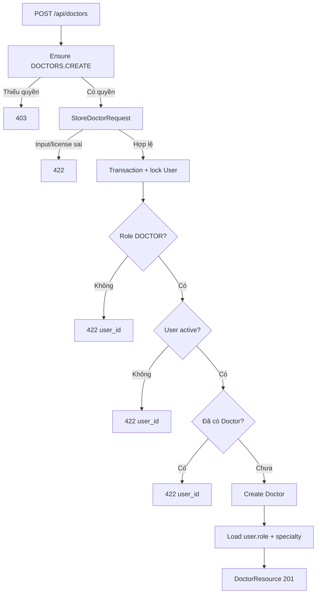

# Kế hoạch CRUD Doctors

## 1. Mục tiêu

Triển khai hồ sơ bác sĩ theo kiến trúc B:

```text
Route
→ auth:sanctum
→ EnsurePermission
→ Form Request
→ DoctorController
→ DoctorService
→ Doctor Model
→ DoctorResource
→ ApiResponse
```

Yêu cầu chính:

- Bảng `doctors` có `user_id` unique foreign key.
- `specialty_id` là foreign key tới `specialties`.
- `license_number` bắt buộc và UNIQUE.
- `bio` nullable, tối đa 5.000 ký tự ở validation.
- User được gắn hồ sơ Doctor phải có role `DOCTOR` và `is_active=true`.
- Một User chỉ có tối đa một hồ sơ Doctor.
- Index filter theo `specialty_id`.
- List/show eager load `user.role` và `specialty`.
- DoctorResource trả đầy đủ nested UserResource và SpecialtyResource.
- CRUD được bảo vệ bằng `DOCTORS.*`.

Tài liệu này chỉ mô tả hướng triển khai. Chưa thực thi code Doctor trước khi review hoàn tất.

## 2. Các quyết định đã chốt

| Nội dung | Quyết định |
|---|---|
| `user_id` | FK, UNIQUE |
| `specialty_id` | FK |
| `license_number` | Bắt buộc, UNIQUE ở DB và Form Request |
| `bio` | Nullable, validation tối đa 5.000 ký tự |
| User role | Bắt buộc role `DOCTOR` |
| User status | Bắt buộc `is_active=true` khi tạo hoặc đổi User |
| Update giữ nguyên `user_id` | Không kiểm tra lại role/status/profile |
| Update đổi `user_id` | Kiểm tra User mới có role DOCTOR, active và chưa có Doctor khác |
| DoctorResource | Trả đầy đủ nested User/Specialty |
| Eager loading | `user.role` và `specialty` |

Điểm quan trọng của update:

```text
Không gửi user_id hoặc gửi đúng user_id hiện tại
→ chỉ cập nhật các field còn lại
→ không kiểm tra lại role/is_active/profile

Gửi user_id khác user_id hiện tại
→ lock User mới
→ kiểm tra role DOCTOR
→ kiểm tra is_active=true
→ kiểm tra chưa có Doctor khác
→ hợp lệ mới cập nhật
```

## 3. Hiện trạng nền đã có

Nhánh:

```text
task/vuongth/T1.15-CRUD-DOCTORS
```

RBAC đã cấu hình sẵn:

```text
DoctorController@index   → DOCTORS.FINDALL
DoctorController@store   → DOCTORS.CREATE
DoctorController@show    → DOCTORS.FINDONE
DoctorController@update  → DOCTORS.UPDATE
DoctorController@destroy → DOCTORS.DELETE
```

Permission catalog đã có đủ:

```text
DOCTORS.FINDALL
DOCTORS.CREATE
DOCTORS.FINDONE
DOCTORS.UPDATE
DOCTORS.DELETE
```

Ma trận quyền hiện tại:

| Role | FINDALL | FINDONE | CREATE | UPDATE | DELETE |
|---|:---:|:---:|:---:|:---:|:---:|
| ADMIN | ✓ | ✓ | ✓ | ✓ | ✓ |
| RECEPTIONIST | ✓ | ✓ |  |  |  |
| DOCTOR | ✓ | ✓ |  |  |  |
| PHARMACIST |  |  |  |  |  |
| CASHIER |  |  |  |  |  |

Nếu Feature Test xác nhận đúng, không sửa `config/rbac.php`, permission migration,
`RbacSeeder`, `EnsurePermission`, `ApiResponse` hoặc Exception Handler.

## 4. API contract

| Method | Endpoint | Action | Permission | Status |
|---|---|---|---|---:|
| GET | `/api/doctors` | `index` | `DOCTORS.FINDALL` | 200 |
| POST | `/api/doctors` | `store` | `DOCTORS.CREATE` | 201 |
| GET | `/api/doctors/{doctor}` | `show` | `DOCTORS.FINDONE` | 200 |
| PUT/PATCH | `/api/doctors/{doctor}` | `update` | `DOCTORS.UPDATE` | 200 |
| DELETE | `/api/doctors/{doctor}` | `destroy` | `DOCTORS.DELETE` | 200 |

Route Model Binding xử lý `{doctor}`. ID không tồn tại trả 404 JSON qua Exception Handler.

## 5. Bước 1 — Migration doctors

Lệnh dự kiến:

```bash
docker compose exec app php artisan make:model Doctor -mf
```

Migration:

```php
Schema::create('doctors', function (Blueprint $table): void {
    $table->id();
    $table->foreignId('user_id')
        ->unique()
        ->constrained('users')
        ->restrictOnDelete();
    $table->foreignId('specialty_id')
        ->constrained('specialties')
        ->restrictOnDelete();
    $table->string('license_number')->unique();
    $table->text('bio')->nullable();
    $table->timestamps();
});
```

Rollback:

```php
Schema::dropIfExists('doctors');
```

Ý nghĩa:

| Cột | Cấu hình | Mục đích |
|---|---|---|
| `id` | Primary key | ID hồ sơ Doctor |
| `user_id` | FK + UNIQUE | Quan hệ User 1-1 Doctor |
| `specialty_id` | FK | Doctor thuộc một Specialty |
| `license_number` | string + UNIQUE | Không trùng chứng chỉ hành nghề |
| `bio` | text nullable | Thông tin chuyên môn |
| timestamps | Laravel timestamps | Thời điểm tạo/cập nhật |

`bio` dùng `text`; giới hạn 5.000 ký tự được kiểm tra ở Form Request.

Đề xuất `restrictOnDelete()` vì:

- Không xóa User đang có Doctor.
- Không xóa Specialty đang được Doctor sử dụng.
- Không dùng cascade để tránh xóa Specialty làm mất hàng loạt hồ sơ Doctor.

### Tích hợp với Specialty delete

Khi đã có FK Doctor → Specialty, `SpecialtyService::delete()` cần chặn trước:

```php
if ($specialty->doctors()->exists()) {
    throw ValidationException::withMessages([
        'specialty' => [
            'The specialty cannot be deleted while doctors are assigned.',
        ],
    ]);
}
```

Nhờ đó API trả 422 rõ ràng thay vì để lỗi foreign key thành 500. Constraint database vẫn
là hàng rào cuối chống race condition.

## 6. Bước 2 — Models và relationships

### Doctor Model

```php
#[Fillable(['user_id', 'specialty_id', 'license_number', 'bio'])]
class Doctor extends Model
{
    use HasFactory;

    public function user(): BelongsTo
    {
        return $this->belongsTo(User::class);
    }

    public function specialty(): BelongsTo
    {
        return $this->belongsTo(Specialty::class);
    }
}
```

### User Model

```php
public function doctor(): HasOne
{
    return $this->hasOne(Doctor::class);
}
```

### Specialty Model

```php
public function doctors(): HasMany
{
    return $this->hasMany(Doctor::class);
}
```

Sơ đồ quan hệ:

```mermaid
erDiagram
    USERS ||--o| DOCTORS : "has one profile"
    SPECIALTIES ||--o{ DOCTORS : "contains"

    USERS {
        bigint id PK
        bigint role_id FK
        boolean is_active
    }

    SPECIALTIES {
        bigint id PK
        string name UK
    }

    DOCTORS {
        bigint id PK
        bigint user_id FK_UK
        bigint specialty_id FK
        string license_number UK
        text bio
    }
```

## 7. Bước 3 — DoctorFactory

File:

```text
database/factories/DoctorFactory.php
```

Factory mặc định phải tạo User role DOCTOR và active sau khi RoleSeeder đã chạy:

```php
return [
    'user_id' => function (): int {
        $doctorRole = Role::query()
            ->where('name', 'DOCTOR')
            ->firstOrFail();

        return User::factory()
            ->for($doctorRole)
            ->create(['is_active' => true])
            ->getKey();
    },
    'specialty_id' => Specialty::factory(),
    'license_number' => fake()->unique()->bothify('LIC-####-????'),
    'bio' => fake()->optional()->paragraph(),
];
```

Trong test nghiệp vụ nên truyền rõ User và Specialty:

```php
Doctor::factory()->create([
    'user_id' => $doctorUser->id,
    'specialty_id' => $specialty->id,
]);
```

## 8. Bước 4 — Form Requests

Tạo:

```text
app/Http/Requests/Doctor/ListDoctorsRequest.php
app/Http/Requests/Doctor/StoreDoctorRequest.php
app/Http/Requests/Doctor/UpdateDoctorRequest.php
```

### ListDoctorsRequest

```php
return [
    'specialty_id' => ['nullable', 'integer', 'exists:specialties,id'],
    'page' => ['nullable', 'integer', 'min:1'],
    'per_page' => ['nullable', 'integer', 'min:1', 'max:100'],
];
```

Ví dụ:

```http
GET /api/doctors?specialty_id=2&page=1&per_page=15
```

### StoreDoctorRequest

```php
return [
    'user_id' => ['required', 'integer', 'exists:users,id'],
    'specialty_id' => ['required', 'integer', 'exists:specialties,id'],
    'license_number' => [
        'required',
        'string',
        'max:100',
        'unique:doctors,license_number',
    ],
    'bio' => ['nullable', 'string', 'max:5000'],
];
```

Form Request kiểm tra dữ liệu và unique license. Service kiểm tra:

- User có role DOCTOR.
- User đang active.
- User chưa có hồ sơ Doctor.

Không đặt `unique:doctors,user_id` trong Request để Service trả business error thống nhất
`The selected user already has a doctor profile.`. UNIQUE database vẫn bảo vệ dữ liệu.

### UpdateDoctorRequest

```php
return [
    'user_id' => ['sometimes', 'required', 'integer', 'exists:users,id'],
    'specialty_id' => ['sometimes', 'required', 'integer', 'exists:specialties,id'],
    'license_number' => [
        'sometimes',
        'required',
        'string',
        'max:100',
        Rule::unique('doctors', 'license_number')
            ->ignore($this->route('doctor')),
    ],
    'bio' => ['sometimes', 'nullable', 'string', 'max:5000'],
];
```

`ignore($this->route('doctor'))` cho phép Doctor giữ nguyên license hiện tại nhưng không được
đổi sang license của Doctor khác.

Body update phải có ít nhất một field:

```php
if (! $this->hasAny(['user_id', 'specialty_id', 'license_number', 'bio'])) {
    $validator->errors()->add(
        'doctor',
        'At least one doctor field must be provided.',
    );
}
```

## 9. Bước 5 — DoctorResource

DoctorResource trả đầy đủ nested UserResource và SpecialtyResource:

```php
return [
    'id' => $this->id,
    'user' => new UserResource($this->whenLoaded('user')),
    'specialty' => new SpecialtyResource($this->whenLoaded('specialty')),
    'license_number' => $this->license_number,
    'bio' => $this->bio,
    'created_at' => $this->created_at?->toISOString(),
    'updated_at' => $this->updated_at?->toISOString(),
];
```

Response mẫu:

```json
{
  "id": 1,
  "user": {
    "id": 5,
    "name": "Dr. Nguyen Van A",
    "email": "doctor.a@clinic.test",
    "is_active": true,
    "role": {
      "id": 3,
      "name": "DOCTOR",
      "display_name": "Bác sĩ"
    }
  },
  "specialty": {
    "id": 2,
    "name": "Khoa Tim",
    "description": "Khám và điều trị tim mạch",
    "created_at": "...",
    "updated_at": "..."
  },
  "license_number": "LIC-0001",
  "bio": "Bác sĩ chuyên khoa tim mạch.",
  "created_at": "...",
  "updated_at": "..."
}
```

UserResource không trả password/token. Permissions không xuất hiện vì Service chỉ load
`user.role`, không load `role.permissions`.

## 10. Bước 6 — DoctorService

### List và show

List bắt buộc eager load:

```php
$query = Doctor::query()->with(['user.role', 'specialty']);

if (isset($filters['specialty_id'])) {
    $query->where('specialty_id', $filters['specialty_id']);
}

return $query
    ->orderByDesc('id')
    ->paginate((int) ($filters['per_page'] ?? 15));
```

Show:

```php
return $doctor->loadMissing(['user.role', 'specialty']);
```

Nhờ eager loading, danh sách không phát sinh thêm hai query cho từng Doctor.

### Business validation helpers

```php
private function assertEligibleDoctorUser(User $user): void
{
    if ($user->role?->name !== 'DOCTOR') {
        throw ValidationException::withMessages([
            'user_id' => ['The selected user must have the DOCTOR role.'],
        ]);
    }

    if (! $user->is_active) {
        throw ValidationException::withMessages([
            'user_id' => ['The selected user must be active.'],
        ]);
    }
}
```

```php
private function assertUserHasNoDoctorProfile(
    User $user,
    ?Doctor $except = null,
): void {
    $query = Doctor::query()->where('user_id', $user->id);

    if ($except !== null) {
        $query->whereKeyNot($except->getKey());
    }

    if ($query->exists()) {
        throw ValidationException::withMessages([
            'user_id' => [
                'The selected user already has a doctor profile.',
            ],
        ]);
    }
}
```

### Create



Pseudo-code:

```php
public function create(array $data): Doctor
{
    return DB::transaction(function () use ($data): Doctor {
        $user = User::query()
            ->with('role')
            ->lockForUpdate()
            ->findOrFail($data['user_id']);

        $this->assertEligibleDoctorUser($user);
        $this->assertUserHasNoDoctorProfile($user);

        return Doctor::query()
            ->create($data)
            ->load(['user.role', 'specialty']);
    });
}
```

`lockForUpdate()` tuần tự hóa hai request đồng thời. UNIQUE `user_id` và
`license_number` là hàng rào cuối ở database.

### Update

Service phân nhánh bằng giá trị `user_id`:

```php
$changesUser = array_key_exists('user_id', $data)
    && (int) $data['user_id'] !== (int) $doctor->user_id;
```

Nhánh không đổi User:

```text
Không có user_id hoặc user_id bằng user hiện tại
→ không kiểm tra lại role
→ không kiểm tra lại is_active
→ không kiểm tra lại doctor profile
→ update specialty/license/bio
→ refresh + eager load
```

Nhánh đổi User:

```text
user_id khác hiện tại
→ transaction
→ lock User mới
→ role phải là DOCTOR
→ is_active phải true
→ chưa thuộc Doctor khác
→ update Doctor
→ refresh + eager load
```

Pseudo-code:

```php
public function update(Doctor $doctor, array $data): Doctor
{
    $changesUser = array_key_exists('user_id', $data)
        && (int) $data['user_id'] !== (int) $doctor->user_id;

    if (! $changesUser) {
        $doctor->update($data);

        return $doctor->refresh()->load(['user.role', 'specialty']);
    }

    return DB::transaction(function () use ($doctor, $data): Doctor {
        $user = User::query()
            ->with('role')
            ->lockForUpdate()
            ->findOrFail($data['user_id']);

        $this->assertEligibleDoctorUser($user);
        $this->assertUserHasNoDoctorProfile($user, $doctor);

        $lockedDoctor = Doctor::query()
            ->lockForUpdate()
            ->findOrFail($doctor->getKey());

        $lockedDoctor->update($data);

        return $lockedDoctor
            ->refresh()
            ->load(['user.role', 'specialty']);
    });
}
```

### Delete

Kế hoạch mặc định hard delete Doctor, không xóa/deactivate User:

```php
public function delete(Doctor $doctor): void
{
    $doctor->delete();
}
```

Response:

```json
{
  "success": true,
  "message": "Doctor deleted",
  "data": null
}
```

## 11. Bước 7 — DoctorController

Controller mỏng:

```php
public function store(StoreDoctorRequest $request): JsonResponse
{
    $doctor = $this->service->create($request->validated());

    return ApiResponse::resource(
        new DoctorResource($doctor),
        'Doctor created',
        201,
    );
}
```

Messages:

| Action | Message |
|---|---|
| index | `Doctors retrieved` |
| store | `Doctor created` |
| show | `Doctor retrieved` |
| update | `Doctor updated` |
| destroy | `Doctor deleted` |

Không đặt business logic hoặc hard-code role trong Controller.

## 12. Bước 8 — Route và permissions

```php
Route::middleware(['auth:sanctum', 'permission'])->group(function (): void {
    Route::apiResource('doctors', DoctorController::class);
});
```

`EnsurePermission` tự map năm action sang `DOCTORS.*`.

## 13. Error contract

### User sai role — 422

```json
{
  "success": false,
  "message": "The selected user must have the DOCTOR role.",
  "errors": {
    "user_id": ["The selected user must have the DOCTOR role."]
  }
}
```

### User inactive — 422

```json
{
  "success": false,
  "message": "The selected user must be active.",
  "errors": {
    "user_id": ["The selected user must be active."]
  }
}
```

### User đã có hồ sơ — 422

```json
{
  "success": false,
  "message": "The selected user already has a doctor profile.",
  "errors": {
    "user_id": ["The selected user already has a doctor profile."]
  }
}
```

### License trùng — 422

```json
{
  "success": false,
  "message": "The license number has already been taken.",
  "errors": {
    "license_number": ["The license number has already been taken."]
  }
}
```

### Thiếu quyền — 403

```json
{
  "success": false,
  "message": "Missing permission: DOCTORS.CREATE",
  "errors": []
}
```

## 14. Bước 9 — Feature Test

File:

```text
tests/Feature/DoctorTest.php
```

Test tối thiểu:

- ADMIN tạo Doctor từ User role DOCTOR active → 201.
- Tạo Doctor từ RECEPTIONIST → 422 `errors.user_id`.
- Tạo Doctor từ User role DOCTOR inactive → 422 `errors.user_id`.
- Tạo Doctor thứ hai cho cùng User → 422.
- Tạo hoặc update trùng `license_number` → 422.
- `bio` dài 5.000 ký tự → hợp lệ.
- `bio` dài 5.001 ký tự → 422.
- List trả đầy đủ nested User/Specialty và pagination meta.
- Filter `?specialty_id=` trả đúng dữ liệu.
- Show trả đầy đủ nested User/Specialty.
- Update không đổi `user_id` không kiểm tra lại role/status.
- Update đổi sang User role khác DOCTOR → 422.
- Update đổi sang User DOCTOR inactive → 422.
- Update đổi sang User DOCTOR active chưa có profile → 200.
- Update đổi sang User đã có Doctor khác → 422.
- Delete Doctor → 200; User vẫn tồn tại.
- Xóa Specialty đang có Doctor → 422, không phải FK 500.
- RECEPTIONIST và DOCTOR list/show → 200.
- RECEPTIONIST/DOCTOR create/update/delete → 403.
- PHARMACIST/CASHIER list → 403.
- Không token → 401.
- Doctor ID không tồn tại → 404 JSON.

## 15. Bước 10 — Postman flow

```text
Login ADMIN
→ tạo Specialty
→ tạo User role DOCTOR active
→ POST Doctor
→ GET list theo specialty_id
→ GET detail
→ PATCH bio/license/specialty không đổi user_id
→ PATCH đổi sang User DOCTOR active khác
→ test User sai role 422
→ test User inactive 422
→ test User đã có profile 422
→ test license trùng 422
→ login RECEPTIONIST
→ GET Doctor 200
→ POST Doctor 403
→ login ADMIN
→ DELETE Doctor
```

Body tạo:

```json
{
  "user_id": 5,
  "specialty_id": 2,
  "license_number": "LIC-0001",
  "bio": "Bác sĩ chuyên khoa tim mạch."
}
```

## 16. Danh sách file dự kiến

### Tạo mới

- `database/migrations/<timestamp>_create_doctors_table.php`
- `app/Models/Doctor.php`
- `database/factories/DoctorFactory.php`
- `app/Http/Requests/Doctor/ListDoctorsRequest.php`
- `app/Http/Requests/Doctor/StoreDoctorRequest.php`
- `app/Http/Requests/Doctor/UpdateDoctorRequest.php`
- `app/Http/Resources/DoctorResource.php`
- `app/Services/DoctorService.php`
- `app/Http/Controllers/DoctorController.php`
- `tests/Feature/DoctorTest.php`

### Chỉnh sửa

- `app/Models/User.php`: thêm `doctor()`.
- `app/Models/Specialty.php`: thêm `doctors()`.
- `app/Services/SpecialtyService.php`: chặn xóa Specialty đang có Doctor.
- `routes/api.php`: thêm Doctor API resource.
- `tests/Feature/SpecialtyTest.php`: test xóa Specialty đang được Doctor sử dụng.

### Không sửa nếu test xác nhận đúng

- `config/rbac.php`.
- Permission migration.
- `RbacSeeder`.
- `EnsurePermission`.
- `ApiResponse`.
- Exception Handler.

## 17. Các điểm còn cần review

Các điểm sau đã chốt:

- License UNIQUE.
- Bio tối đa 5.000 ký tự.
- Chỉ kiểm tra lại User khi `user_id` thực sự thay đổi.
- User mới phải role DOCTOR và active.
- DoctorResource trả đầy đủ nested User/Specialty.

Các đề xuất còn lại:

1. DELETE Doctor dùng hard delete và trả 200 `data:null`.
2. FK User/Specialty dùng `restrictOnDelete()`.
3. Specialty đang có Doctor không được xóa và trả 422.
4. Index hiện chỉ filter `specialty_id`; chưa thêm search tên/license.

## 18. Điều kiện hoàn thành

- Migration chạy/rollback đúng.
- `user_id` unique FK, `specialty_id` FK và `license_number` UNIQUE.
- Quan hệ User 1-1 Doctor, Specialty 1-n Doctor đúng.
- Create chỉ nhận User DOCTOR active chưa có hồ sơ.
- Update không đổi User không chạy lại business validation.
- Update đổi User kiểm tra role DOCTOR, active và duplicate profile.
- Bio tối đa 5.000 ký tự.
- Năm API trả đúng status và JSON envelope.
- Controller mỏng, business logic nằm trong Service.
- List filter `specialty_id` và eager load `user.role`, `specialty`.
- DoctorResource trả đầy đủ nested User/Specialty, không lộ password/token.
- RBAC đúng ma trận, không hard-code role trong Controller.
- Specialty đang có Doctor không bị xóa và trả 422.
- DoctorTest, regression suite và Pint đều pass.
